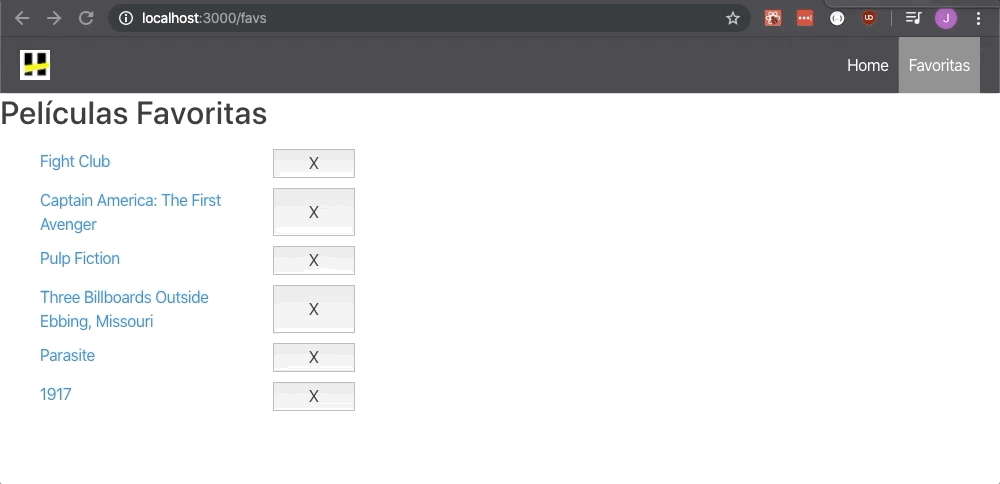

# Redux OMDB APP

En este ejercicio vamos a crear una APP que utilice la API de [OMDB](http://www.omdbapi.com/). Vamos a crear nuestra app utilizando __REACT__ y __REDUX__.

> Vamos a necesitar una APIKEY ya que la API de OMDB es paga. Usen `apikey=20dac387`

Con tu App podremos:

* Buscar películas y listarlas.
* Poder ver todos los detalles de una película en particular.
* Poder agregar las películas a tu lista de favoritos.
* Poder sacar películas de tu lista de favoritos.

## Estructura

Agregar las carpetas actions, components, constants, middleware, reducers y store para que que la estructura de carpetas quede de la siguiente forma:

```bash.
├── public
├── src
│   ├── /actions
│   ├── /components
│   ├── /constants
│   ├── /middleware
│   ├── /reducers
│   ├── /store
│   ├── App.css
│   ├── App.js
│   ├── App.test.js
│   ├── index.css
│   ├── index.jss
│   ├── serviceWorker.js
│   └── setupTests.js
├── .gitignore
├── package-lock.json
├── package.json
└── README.md
```

* __src__: Carpeta donde estará el código fuente del front-end de nuestra app.
    * __actions__: Las acciones que enviaremos a nuestro store.
    * __components__: Todos nuestros componentes de REACT junto con su CSS.
    * __constants__: Constantes a utilizar por la aplicación
    * __middleware__:  Intermediario que va a ser utilizado para validaciones
    * __reducers__: Todos los reducers definidos irán aquí
    * __store__: Mantiene todo el estado de la aplicación
    * __App.js__: Aplicación principal
    * __index.js__: Punto de partida de nuestra aplicación

Antes de empezar a codear, vamos a pensar un diseño para nuestra página y hacer una lista con los __componentes__ y __containers__ que vamos a tener.
Empezaremos por los más pequeños y simples (los puramente presentacionales sobre todo).
Cuando nos toque crear un __container__ de _Redux_ pensaremos las props del _Estado_ que vamos a mapear al container y las acciones que van a disparar. Luego codearemos primero las acciones, luego los reducers y por último el Container.


### Rutas

Nuestra aplicación tiene que tener un set de rutas ya definido para hacer la pagina navegable.

* `/`: la ruta de home que tiene un input para hacer la búsqueda.
* `/movie/:id`: muestra los detalles de una película en particular.
* `/favs/`: muestra un listado de las películas favoritas, (cuando tengamos usuarios puede que esta ruta cambie).

> Para poder emular lo de guardar a favoritos, vamos a guardar las películas favoritas en el __Estado__ de nuestra aplicación.

### Comenzamos

Para poder comenzar tenemos que instalar las dependencias que utilizaremos. Tendran en el `package.json` ya las dependencias. Ahora hacemos:

```javascript
npm install
```

Comemnzamos creando nuestros componentes. Dentro de nuestra carpeta `components` crearemos subcarpetas con nuestros nuestro archivo.js y .css para tener mas acomodado nuestro codigo.
En la carpeta `components` crearemos 4 subcarpetas: `Buscador`. `Favorites`, `Movie`, `NavBar`. Y en cada una crearemos sus respectivos archivos .js y .css.
`NavBar.js` sera nuestro Header que nos permitira navegar por nuestras rutas.
`Buscador.js` sera nuestro Home, en donde buscaremos peliculas (llamando a la API) y las mostraremos en forma de lista.
En `Favorites.js` mostraremos la lista de peliculas a las cuales seleccionamos como Favoritas.
Y por ultimo en `Movie.js` sera nuestro compente en donde mostraremos una pelicula en detalle. Accedemos a este componente haciendo click dentro de nuestro buscador o en nuestras favoritas.

### Armemos nuestro enrutado:

```javascript
// index.js
ReactDOM.render(
  <BrowserRouter>
    <App />
  </BrowserRouter>,
  document.getElementById('root')
);

```

### Componentes principales

Comenzamos creando nuestros componentes principales.

NavBar: sera un componente estatico, tendra los links que nos permitan navegar hacia Favoritos y Home. Ej:

<div style="text-align:center"></div><br>

Buscador: Sera nuestra Home, nos permitira hacer pedidos a la API, traer la lista de peliculas y mostrarlas. Sera un componente de clase. Ej:

<div style="text-align:center"></div><br>


Una vez que tenemos estos componentes:


### Creamos nuestro Reducer

Vamos al archivo `index.js` en nuestra carpeta reducers. Como vimos, un reducer es simplemente una funcion que recibe 2 parametros: state y action. Y depende la `action` que reciba nos devuelve el estado actualizado. Al comienzo del archivo creamos nuestro estado inicial. Lo llamamos `initialState`:

```javascript
const initialState = {
  movies: [],
  moviesLoaded: []
};
```
Por ahora tendremos un solo estado, despues iremos agregando mas. Pasamos a crear nuestro reducer:

```javascript
function rootReducer(state = initialState, action) {
  if (action.type === "ADD_MOVIE") {
      return {
        ...state,
        movies: state.movies.concat(action.payload)
      }
  }
  if (action.type === "DATA_LOADED") {
      return {
        ...state,
        moviesLoaded: action.payload.Search
      };
  }
  return state;
}

export default rootReducer;
```

Ya tenemos la base de nuestro reducer. Como sabemos el `initialState` es inmutable, por eso a la hora del return, hacemos una copia de este, con sintaxis de ES6 (spread operator) otra opcion seria usar `Object.assign({}, state, ...)`, y nos devuelve nuestro `state` actualizado. Exportamos el reducer para poder usarlo en nuestro store. Para entenderlo mejor pueden leer [aca](https://redux.js.org/recipes/structuring-reducers/immutable-update-patterns).

### Creamos nuestras Actions

En nuestro archivo `index.js` en nuestra carpeta actions. Por ahora vamos a crear 2 actions. Una para hacer la request a la API y traer las peliculas, y la otra para agregarlas como Favoritas.

```javascript
export function addMovie(payload) {
  return { type: "ADD_MOVIE", payload };
}

export function getData(titulo) {
  return function(dispatch) {
    return fetch("http://www.omdbapi.com/?apikey=20dac387&s=" + titulo)
      .then(response => response.json())
      .then(json => {
        dispatch({ type: "DATA_LOADED", payload: json });
      });
  };
}
```
Cada accion devuelve un objecto, la primera key de este objecto es el `type`, su valor lo ponemos nosotros, por convencion se usan mayusculas y guion bajo (_) para separar. Como segundo argumento recibe un `payload`, que son datos que puede llevar que usaremos en nuestro reducer para actualizar el estado. En `addMovie` el payload que pasaremos cuando hagamos un dispatch de esa action sera el nombre de la Pelicula, en `getData`, nuestro payload sera el objeto que recibamos de nuestra request.

### Armamos nuestro store

Ahora pasamos a crear nuestro Store Global que tendra todo nuestro State. Vamos a nuestro archivo `index.js` en nuestra carpeta store, tenemos que importar `CreateStore` de 'redux', por ahora nos deberia quedar asi:

```javascript
import { createStore } from "redux";

const store = createStore();

export default store;
```
La funciton `createStore` recibe argumentos. Primero le pasaremos nuestro `rootReducer` y despues nuestro Middleware para poder hacer peticiones asincronas en nuestro codigo.

### Conectamos el Store con nuestro rootReducer y Middleware

Ya tenemos nuestro Reducer y nuestras actions. Entonces terminamos de conectar nuestro store, para esto importamos `applyMiddleware` de 'redux', `thunk` de la libreria 'redux-thunk' y nuestro Reducer. Pasamos como parametros en `createStore` nuestro rootReducer y applyMiddleware, a esta le pasamos nuestro middleware `thunk`. Usamos un Middleware para poder hacer peticiones AJAX sin problemas. Nos quedaria algo asi:

```javascript
const store = createStore(
  rootReducer,
  applyMiddleware(thunk)
);

export default store;
```

### Conectamos nuestro Store con nuestra App de React

Es hora de conectar todo. Para eso necesitaremos de un componente que nos brinda la libreria 'react-redux', que se llama `Provider`. En nuestro Provider llamamos a nuestro store, y con este envolvemos a toda nuestra App, para tener acceso a nuestro store desde cualquier componente hijo.

```javascript
//root index.js

ReactDOM.render(
  <Provider store={store}>
    <BrowserRouter>
      <App />
    </BrowserRouter>
  </Provider>,
  document.getElementById('root')
);
```
Ya tenemos nuestro STORE conectado con nuestra App!

### Conectamos nuestro componente con nuestro Store

Usamos las funciones `mapStateToProps` y `mapDispatchToProps` dentro de nuestros componentes. La primera nos permite traer nuestro state global como props a nuestro componente, y la segunda nos permite hacer el `dispatch` de nuestras actions al store. Y para terminar de conectar nuestro componente con el store global usamos una HoC ( High Order Component ) que importamos de la libreria 'react-redux' que se llama `connect`. En nuestro componente `Busqueda.js` nos deberia quedar algo asi:

```javascript
function mapStateToProps(state) {
  return {
    movies: state.moviesLoaded
  };
}

function mapDispatchToProps(dispatch) {
  return {
    addMovie: movie => dispatch(addMovie(movie)),
    getData: title => dispatch(getData(title))
  };
}

export default connect(
  mapStateToProps,
  mapDispatchToProps
)(Post);
```

Pasamos a explicar un poco que estamos haciendo. `mapStateToProps` recibe como parametro `state` y nos devuelvo un objecto con parte del state que queremos, en este caso usamos la key 'movies' (accedemos a ella en nuestro componente como this.props.movies) y su value es la parte del estado que queremos traer, `moviesLoaded` en este caso.
`mapDispatchToProps` recibe como parametro una funcion, la llamamos dispatch, y nos devuelve un objecto, con las acciones que queremos enviar a nuestro store. Los nombres son arbitrarios, son los que usaremos para acceder a estos en nuestro componentes via props. Cada funcion nos devuelve la funcion dispatch que recibe como parametro la action que queremos enviar al store, en nuestro caso son `addMovie` y `getData` que tenemos en nuestra carpeta `actions`. Los parametros que recibe cada function son los payloads que usamos en nuestra action.

### Dispatch una accion desde nuestro componente

Lo siguiente que haremos sera crear un form, con un input y un boton de type="submit". Nuestro form tendra un evento `onSubmit` que maneje la request. Nuestro evento simplemente ejecutara la funcion `getData`, a la cual le pasamos el valor del string ingresado en el input (nombre de pelicula). Como ayuda para obtener el valor ingresado en el input, podemos usar `React.createRef()` para tener una referencia del valor ingresado en el input o usando el evento `onChange` en el input y guardando el valor en el state del componente.

### Obtener y mostrar nuestro cambio de State

Una vez que hacemos el dispatch, ya tenemos nuestro state en nuestro Store, en `mapStateToProps` ya traemos el state que updeteamos en nuestro form. Ahora tenemos un array de objetos con las peliculas que nos trajo nuestra request a la API. El siguiente paso seria mapear ese array y hacer un return con el Nombre de la pelicula y un boton el cual tendra un evento de `onClick`. Este evento sera `addMovie`, que tenemos en nuestra `mapDispatchToProps` para guardar peliculas como Favoritas. Ej:

<div style="text-align:center"></div><br>

 En el caso de `addMovie` como parametro le pasamos un object con el titulo de la Pelicula y su ID, que mas adelante utilizaremos en el componente Favorites. Ej:

```javascript
//Recordamos que nuestro button se encuentra dentro del metodo map

<button onClick={() => this.props.addMovie({title: movie.Title, id: movie.imdbID})}>Fav</button>
```

Hasta ahora tenemos nuestro componente Home, en donde podemos buscar peliculas, guardarlas en nuestro state global, y mostrarlas. Las peliculas que nos trae la request la estamos guardando en `moviesLoaded` y las que seleccionamos como favoritas en `movies`. El siguiente paso sera comenzar a hacer el enrutado para mostrar nuestras pelis Favoritas.

### Creamos componente Favorites y hacemos el Enrutado

En `components` creamos una subcarpeta Favorites en donde tendremos nuestro componente `Favorites.js` y `Favorites.css`. Este sera un componente de clase, que llame a `mapStateToProps` y `mapDispatchToProps` como hicimos anteriormente. `mapStateToProps` nos traera simplemente `state.movies` y  `mapDispatchToProps` tendra un dispatch para eliminar peliculas de favoritos. Del mismo modo para agregar una pelicula. Tenemos que agregar en nuestro reducer agregamos el caso para cuando nuestro action.type sea "REMOVE_MOVIE" por ejemplo, y que nos devuelva una copia del state y `movies` con su valor actualizado sin la pelicula que se selecciono para eliminar. Recordemos que el nombre de la pelicula la pasamos como payload en nuestro dispatch y usamos ese dato en nuestro reducer.
Una vez que tenemos nuestro case en nuestro reducer. Vamos a nuestras `actions` y creamos una function que podemos llamar `removeMovie` que recibira nuestro payload como parametro y simplemente nos devolvera un objeto con nuestro type: "REMOVE_MOVIE" y nuestro payload. Ya tenemos lo que necesitamos para mostrar nuestras pelis favoritas y nuestro evento para eliminarlas. Como hicimos en `Buscador.js`, mapeamos nuestras peliculas, y hacemos un return con el nombre y un boton que tendra el evento para eliminarlas. Ej:

<div style="text-align:center"></div><br>

Ahora vamos a nuestro archivo `App.js` para hacer nuestro enrutado:

```javascript
function App() {
  return (
      <React.Fragment>
          <NavBar />
          <Route exact path="/" component={Buscador} />
          <Route path="/favs" component={Favorites} />
      </React.Fragment>
  );
}
```
Por ahora nos deberia quedar algo asi, despues agregaremos una ruta mas para mostrar una pelicula en detalle...
No nos olvidamos de agregar los links de navegacion en nuestro componente `NavBar`.

### Creamos componente Movie

Ya nos queda poco! En `components` creamos una subcarpeta `Movie` en donde tendremos nuestro componente. Este tendra una ruta dinamica que cargaremos segun el ID de la pelicula que quieramos mostrar. En nuestra `App.js` la agregamos:

```javascript
function App() {
  return (
      <React.Fragment>
          <NavBar />
          <Route exact path="/" component={Buscador} />
          <Route path="/favs" component={Favorites} />
          <Route path="/movie/:id" component={Movie} />
      </React.Fragment>
  );
}
```
Ahora tenemos que agregar una ultima `action`, que sera una request a la API para traer una pelicula especifica por ID. Nos deberia quedar algo asi:

```javascript
export function getMovieDetail(id) {
  return function(dispatch) {
    const url = `http://www.omdbapi.com/?apikey=20dac387&i=${id}&plot=full`
    return fetch(url)
      .then(response => response.json())
      .then(json => {
        dispatch({ type: "MOVIE_DETAIL", payload: json });
      });
  }
}
```
Tenemos nuestra action type y nuestro payload sera nuestro objecto con todos los datos de la Pelicula. Nuestro siguiente paso sera agregar ese caso en nuestro reducer. Para mantener separados nuestro state, agregamos un valor a nuestro `initialState`, se puede llamar `movieDetail` y sera un objecto vacio. Ahora en nuestro reducer agregamos el caso para cuando nuestro action.type sea "MOVIE_DETAIL", como veniamos haciendo, hacemos una copia del state y en movieDetail agregamos nuestro action.payload. Por ultimo, en nuestro componente `Movie.js` llamamos a `mapDispatchToProps` para hacer la dispatch del action que recibira como parametro el id de la pelicula, y `mapStateToProps` que nos traera `state.movieDetail`. Ahora lo unico que nos falta es saber que ID le pasamos a nuestra funcion `getMovieDetail` cuando la llamamos para que nos traiga una pelicula especifica. Ese ID lo recibiremos en nuestros parametros de la url. En nuestros componentes `Favorites.js` y `Buscador.js` veremos que cuando mapeamos nuestro array con peliculas, cada pelicula tiene un `imdbID` usaremos ese ID como parametro, entonces en donde renderizamos el Titulo de la Pelicula, lo envolvemos en un Link y le pasamos como parametro ese ID que recibimos. Algo asi:

```javascript
//Buscador.js 

<Link to={`/movie/${movie.imdbID}`}>
  {movie.Title}
</Link>
```

Ahora cuando hagamos click en alguna pelicula nos deberia llevar a la ruta `/movie/{movie-id}`. En nuestro componente Movie tenemos que usar ese parametro para usarlo en nuestra `getMovieDetail` function. Podemos acceder a este valor gracias a las `props` que nos da `react-router` de la siguientes maneras:

```javascript
// usando destructuring
const { match: { params: { id }}} = this.props;

// manera convencional
const movieId = this.props.match.params.id;
```
Llamamos a la funcion `getMovieDetail` y le pasamos nuestro ID. Una vez obtenido los datos tendriamos que tenerlos en `this.props.movieDetail` (obtenidos desde nuestro mapStateToProps). Y por ultimo mostramos detalles de la pelicula por ej: Titulo, Año, Rating, Plot, Premios, Genero, etc... Ej:

<div style="text-align:center"></div><br>

Con esto tendriamos una App integrado con React Redux!

### Extra

* Agregar un custom middleware que valide que las películas que estemos agregando a favoritos no esten ya incluidas

* Implementar animaciones con estos [addOns](https://facebook.github.io/react/docs/animation.html) de React.

* Diferenciar la búsqueda entre series y películas, ¿esto implicaría crear otra ruta?
